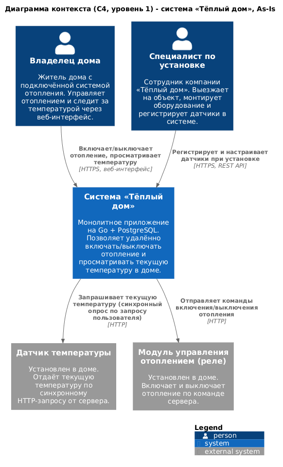
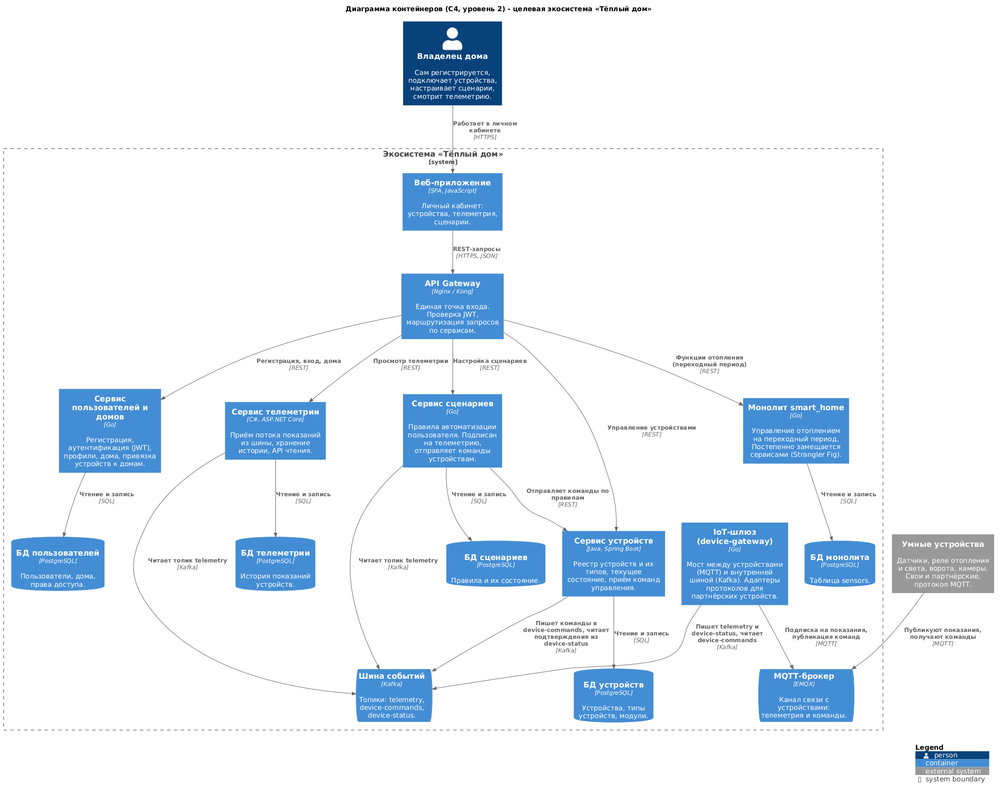
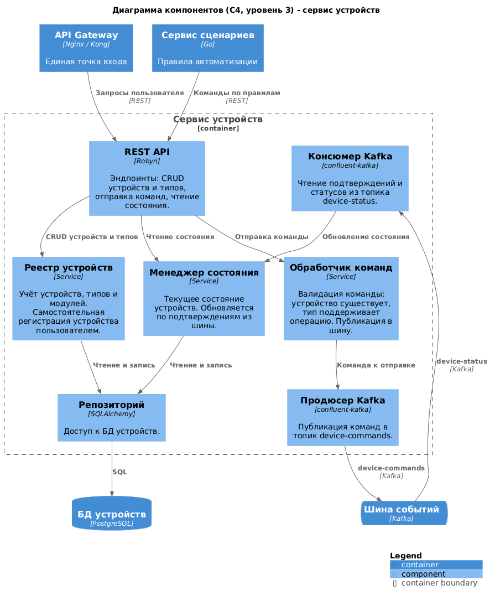
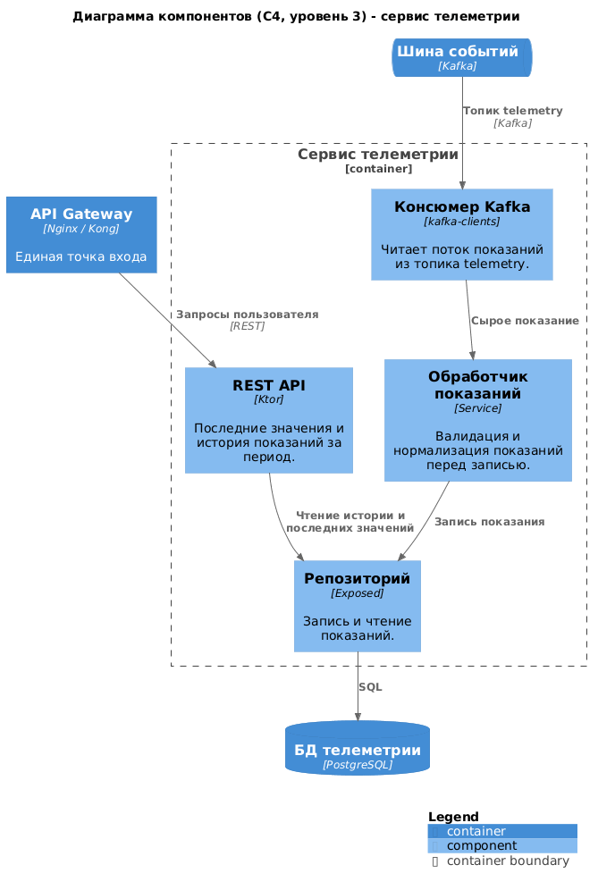
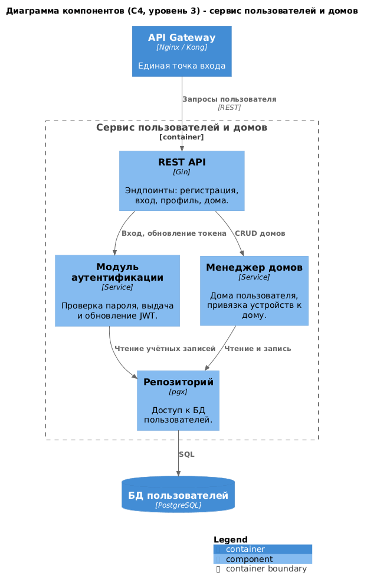
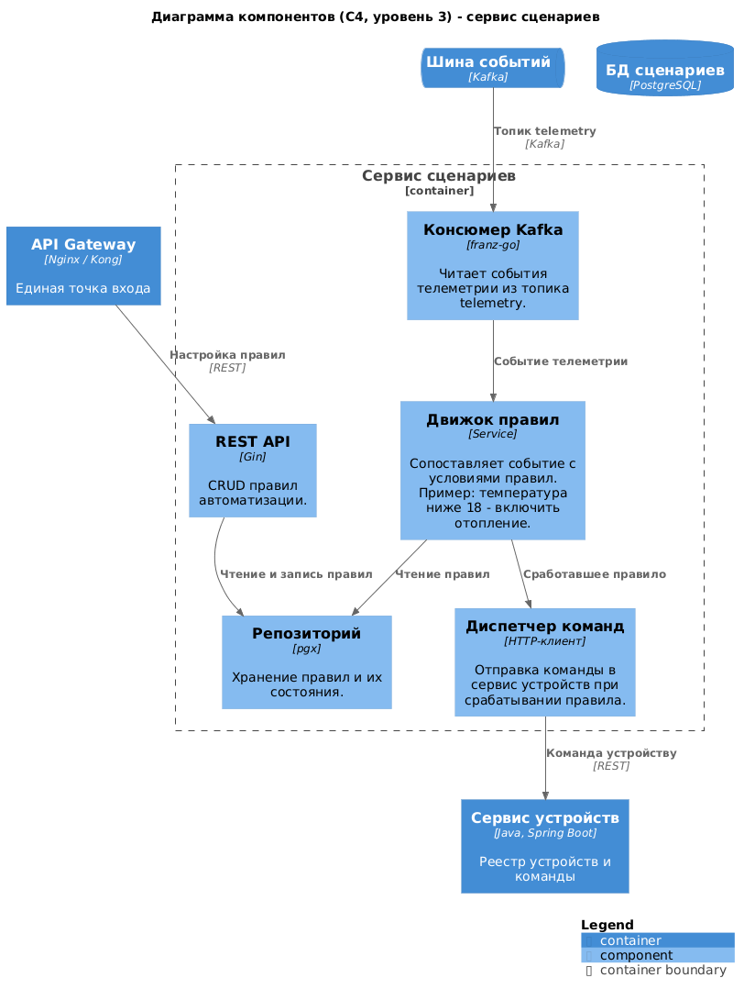
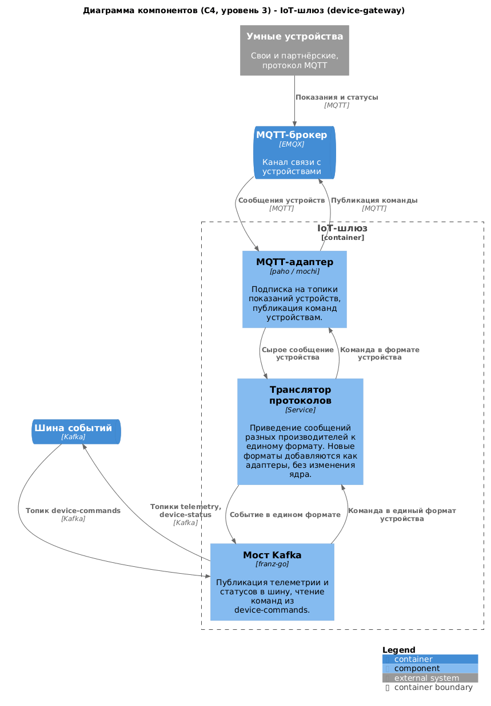
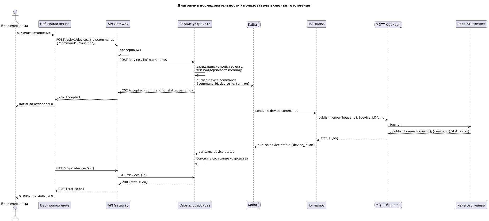
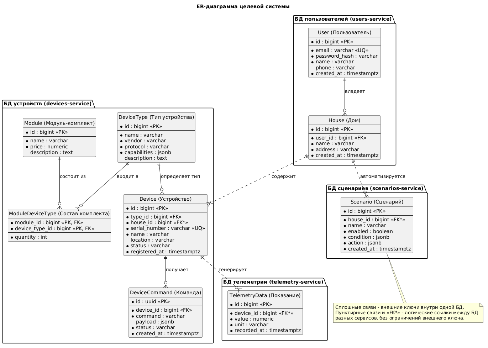

# Project_template

Это шаблон для решения проектной работы. Структура этого файла повторяет структуру заданий. Заполняйте его по мере работы над решением.

# Задание 1. Анализ и планирование

<aside>

Чтобы составить документ с описанием текущей архитектуры приложения, можно часть информации взять из описания компании и условия задания. Это нормально.

</aside

### 1. Описание функциональности монолитного приложения

**Управление отоплением:**

- Пользователи могут удалённо включать и выключать отопление в своём доме через веб-интерфейс.
- Система поддерживает только модель управления «от сервера к устройству»: все команды инициируются сервером, устройства сами ничего не отправляют.
- Подключение дома к системе выполняется только специалистом компании: он выезжает на объект, монтирует оборудование и регистрирует датчик в системе через REST API (`POST /api/v1/sensors`). Самостоятельное подключение пользователем не предусмотрено.

**Мониторинг температуры:**

- Пользователи могут просматривать текущую температуру в своём доме через веб-интерфейс - как по конкретному датчику (`GET /api/v1/sensors/{id}`), так и по локации (`GET /api/v1/sensors/temperature/{location}`).
- Система получает показания синхронным HTTP-запросом к датчику в момент обращения пользователя: обработчик запроса блокируется до ответа датчика (таймаут - 10 секунд).
- Система хранит только последнее значение температуры (поле `value` в таблице `sensors`). История показаний (телеметрия) не накапливается.

### 2. Анализ архитектуры монолитного приложения

- **Язык программирования:** Go (веб-фреймворк Gin).
- **База данных:** PostgreSQL (драйвер pgx, пул соединений). Схема данных состоит из единственной таблицы `sensors`. Сущностей «пользователь», «дом», «тип устройства» в модели данных нет.
- **Архитектура:** монолитная - обработка HTTP-запросов, бизнес-логика и доступ к данным находятся в одном приложении и развёртываются как единый процесс. Внутри код разделён на слои (`handlers`, `services`, `db`, `models`), но границ между функциональными областями нет.
- **Взаимодействие:** полностью синхронное. Запросы обрабатываются последовательно. При запросе списка датчиков (`GET /api/v1/sensors`) монолит в цикле по очереди опрашивает каждый температурный датчик по HTTP. Асинхронных вызовов, очередей сообщений и событий в системе нет.
- **Масштабируемость:** ограничена - монолит можно масштабировать только целиком (вертикально или репликацией всего приложения), отдельные функции (например, только опрос датчиков) масштабировать нельзя.
- **Развёртывание:** любое обновление требует пересборки и перезапуска всего приложения, то есть остановки всей системы.
- **Безопасность:** аутентификация и авторизация отсутствуют - API открыт для всех, датчики не привязаны к пользователям.

### 3. Определение доменов и границы контекстов

Домены текущего (As-Is) решения:

- **Домен «Управление устройствами»** - учёт датчиков и модулей отопления: регистрация, настройка, привязка к локации, удаление. В коде это CRUD-операции над таблицей `sensors`. Граница контекста - жизненный цикл устройства от установки до списания, о показаниях контекст ничего не знает.
- **Домен «Мониторинг (телеметрия)»** - получение и предоставление показаний датчиков. В коде это `TemperatureService` (синхронный опрос датчика по HTTP) и выдача значений пользователю. Граница контекста - сбор и чтение показаний, устройствами контекст не управляет.
- **Домен «Управление отоплением»** - команды включения/выключения отопления и изменение состояния устройства (`PATCH /api/v1/sensors/{id}/value`). Граница контекста - доставка команд до исполнительного устройства (реле).

В монолите все три контекста реализованы в одной кодовой базе, работают с одной таблицей `sensors` и жёстко связаны друг с другом - фактические границы между ними не проведены.

Для целевой (To-Be) системы к ним добавятся новые домены: «Пользователи и дома» (регистрация, самообслуживание, привязка устройств к домам), «Сценарии автоматизации» (программирование поведения устройств пользователем) и «Телеметрия» как самостоятельный домен с историей показаний.

### **4. Проблемы монолитного решения**

- **Производительность и отказоустойчивость чтения показаний.** Температура запрашивается синхронно в момент обращения пользователя, а для списка датчиков - последовательно в цикле. Время ответа растёт линейно с числом датчиков, а один недоступный датчик (таймаут 10 секунд) задерживает весь запрос. Уже при 100 модулях это проблема.
- **Масштабирование только целиком.** Нельзя отдельно масштабировать «горячие» функции (опрос датчиков, приём телеметрии), не масштабируя всё остальное.
- **Развёртывание с простоем.** Каждый релиз останавливает всю систему. Работа пяти разработчиков в одной кодовой базе означает частые релизы и высокий риск конфликтов.
- **Отсутствие изоляции отказов.** Ошибка в любой части (например, в опросе датчиков) роняет всё приложение, включая управление отоплением.
- **Модель данных не соответствует целевым требованиям.** Поддерживается только тип `temperature`; нет пользователей, домов, типов устройств, истории телеметрии - расширение на свет, ворота и видеонаблюдение потребует переработки схемы.
- **Нет самообслуживания.** Регистрация устройства возможна только специалистом при выезде - это блокирует бизнес-модель SaaS и масштабирование на несколько регионов.
- **Закрытость для партнёрских устройств.** Нет стандартных протоколов подключения и механизма добавления новых, заранее неизвестных типов устройств.
- **Нет асинхронного взаимодействия.** Без событий и очередей невозможно реализовать сценарии автоматизации, уведомления и эффективный сбор телеметрии с тысяч устройств.
- **Нет аутентификации и авторизации.** В SaaS-модели с множеством пользователей это недопустимо.

### 5. Визуализация контекста системы — диаграмма С4

Исходник диаграммы: [schemas/task1-c4-context-as-is.puml](schemas/task1-c4-context-as-is.puml)



Диаграмма показывает взаимодействие монолита с внешним миром: владелец дома управляет отоплением и просматривает температуру через веб-интерфейс, специалист по установке регистрирует датчики при выезде на объект. Монолит синхронно по HTTP опрашивает датчики температуры и отправляет команды модулям управления отоплением (реле).

# Задание 2. Проектирование микросервисной архитектуры

В этом задании вам нужно предоставить только диаграммы в модели C4. Мы не просим вас отдельно описывать получившиеся микросервисы и то, как вы определили взаимодействия между компонентами To-Be системы. Если вы правильно подготовите диаграммы C4, они и так это покажут.

**Диаграмма контейнеров (Containers)**

Исходник: [schemas/task2-c4-containers-to-be.puml](schemas/task2-c4-containers-to-be.puml)



Ключевые решения:

- Выделены микросервисы по доменам: пользователи и дома, устройства, телеметрия, сценарии. У каждого сервиса своя БД (database per service).
- Устройства подключаются по MQTT и сами публикуют показания (push). Сервер больше не опрашивает их в цикле, как в монолите.
- IoT-шлюз (device-gateway) - мост между MQTT и внутренней шиной. Партнёрские и еще неизвестные устройства подключаются через адаптеры протоколов в шлюзе, ядро системы менять не нужно.
- Внутренняя шина событий - Kafka, топики telemetry, device-commands, device-status. Через нее идут телеметрия и команды устройствам.
- Новый тип устройства - это запись в справочнике типов в сервисе устройств, а не код. Свет, ворота и камеры добавляются без релиза.
- Монолит остается на переходный период и продолжает обслуживать отопление (паттерн Strangler Fig). По мере переноса функций в сервисы устройств и телеметрии он выводится из эксплуатации.
- Видеонаблюдение на этом этапе - просто тип устройства (камера, статусы, снимки). Потоковое видео потребует отдельного стриминг-сервиса, в рамках спринта он сознательно не прорабатывался.

**Диаграмма компонентов (Components)**

Компонентные диаграммы сделаны для каждого из пяти выделенных микросервисов. Для веб-приложения, API Gateway и монолита компонентные диаграммы не делались: gateway и веб-приложение - готовые инфраструктурные решения, а монолит подлежит выводу из эксплуатации, его внутреннее устройство описано выше.

Сервис устройств ([schemas/task2-c4-components-devices.puml](schemas/task2-c4-components-devices.puml)):



Сервис телеметрии ([schemas/task2-c4-components-telemetry.puml](schemas/task2-c4-components-telemetry.puml)):



Сервис пользователей и домов ([schemas/task2-c4-components-users.puml](schemas/task2-c4-components-users.puml)):



Сервис сценариев ([schemas/task2-c4-components-scenarios.puml](schemas/task2-c4-components-scenarios.puml)):



IoT-шлюз ([schemas/task2-c4-components-device-gateway.puml](schemas/task2-c4-components-device-gateway.puml)):



**Диаграмма кода (Code)**

Sequence-диаграмма самого критичного потока - команда «включить отопление» от пользователя до реле и подтверждение обратно.

Исходник: [schemas/task2-code-sequence-turn-on-heating.puml](schemas/task2-code-sequence-turn-on-heating.puml)



Важный момент на диаграмме: команда доставляется асинхронно. Пользователь сразу получает 202 Accepted, а фактическое состояние устройства обновляется позже, по подтверждению из шины. Так один недоступный датчик не блокирует систему, в отличие от монолита с его синхронным опросом.

# Задание 3. Разработка ER-диаграммы

Исходник: [schemas/task3-er-diagram.puml](schemas/task3-er-diagram.puml)



Сущности сгруппированы по базам данных сервисов (database per service). Связи между таблицами одной БД - обычные внешние ключи (сплошные линии). Ссылки между БД разных сервисов - логические, без ограничений FK, на диаграмме они пунктиром и помечены `FK*`. Целостность таких ссылок обеспечивается на уровне сервисов.

Связи между сущностями:

- User - House: один ко многим. У пользователя может быть несколько домов, дом принадлежит одному пользователю.
- House - Device: один ко многим. В доме много устройств, устройство привязано к одному дому.
- DeviceType - Device: один ко многим. Тип определяет протокол и возможности устройства (поле capabilities). Новый тип устройства, в том числе партнёрского, добавляется записью в справочник без изменения кода.
- Module - DeviceType: многие ко многим через ModuleDeviceType. Модуль - это продаваемый комплект, в него входит несколько типов устройств, один тип может входить в разные комплекты.
- Device - TelemetryData: один ко многим. Устройство генерирует множество показаний, история хранится в БД телеметрии.
- Device - DeviceCommand: один ко многим. Каждая отправленная команда фиксируется со статусом (pending, sent, confirmed, failed) - это журнал асинхронной доставки команд.
- House - Scenario: один ко многим. Сценарий автоматизации действует в рамках дома, условия и действия хранятся в jsonb - формат правил можно расширять без миграций схемы.

# Задание 4. Создание и документирование API

### 1. Тип API

Укажите, какой тип API вы будете использовать для взаимодействия микросервисов. Объясните своё решение.

### 2. Документация API

Здесь приложите ссылки на документацию API для микросервисов, которые вы спроектировали в первой части проектной работы. Для документирования используйте Swagger/OpenAPI или AsyncAPI.

# Задание 5. Работа с docker и docker-compose

Перейдите в apps.

Там находится приложение-монолит для работы с датчиками температуры. В README.md описано как запустить решение.

Вам нужно:

1) сделать простое приложение temperature-api на любом удобном для вас языке программирования, которое при запросе /temperature?location= будет отдавать рандомное значение температуры.

Locations - название комнаты, sensorId - идентификатор названия комнаты

```
	// If no location is provided, use a default based on sensor ID
	if location == "" {
		switch sensorID {
		case "1":
			location = "Living Room"
		case "2":
			location = "Bedroom"
		case "3":
			location = "Kitchen"
		default:
			location = "Unknown"
		}
	}

	// If no sensor ID is provided, generate one based on location
	if sensorID == "" {
		switch location {
		case "Living Room":
			sensorID = "1"
		case "Bedroom":
			sensorID = "2"
		case "Kitchen":
			sensorID = "3"
		default:
			sensorID = "0"
		}
	}
```

2) Приложение следует упаковать в Docker и добавить в docker-compose. Порт по умолчанию должен быть 8081

3) Кроме того для smart_home приложения требуется база данных - добавьте в docker-compose файл настройки для запуска postgres с указанием скрипта инициализации ./smart_home/init.sql

Для проверки можно использовать Postman коллекцию smarthome-api.postman_collection.json и вызвать:

- Create Sensor
- Get All Sensors

Должно при каждом вызове отображаться разное значение температуры

Ревьюер будет проверять точно так же.


# **Задание 6. Разработка MVP**

Необходимо создать новые микросервисы и обеспечить их интеграции с существующим монолитом для плавного перехода к микросервисной архитектуре. 

### **Что нужно сделать**

1. Создайте новые микросервисы для управления телеметрией и устройствами (с простейшей логикой), которые будут интегрированы с существующим монолитным приложением. Каждый микросервис на своем ООП языке.
2. Обеспечьте взаимодействие между микросервисами и монолитом (при желании с помощью брокера сообщений), чтобы постепенно перенести функциональность из монолита в микросервисы. 

В результате у вас должны быть созданы Dockerfiles и docker-compose для запуска микросервисов. 